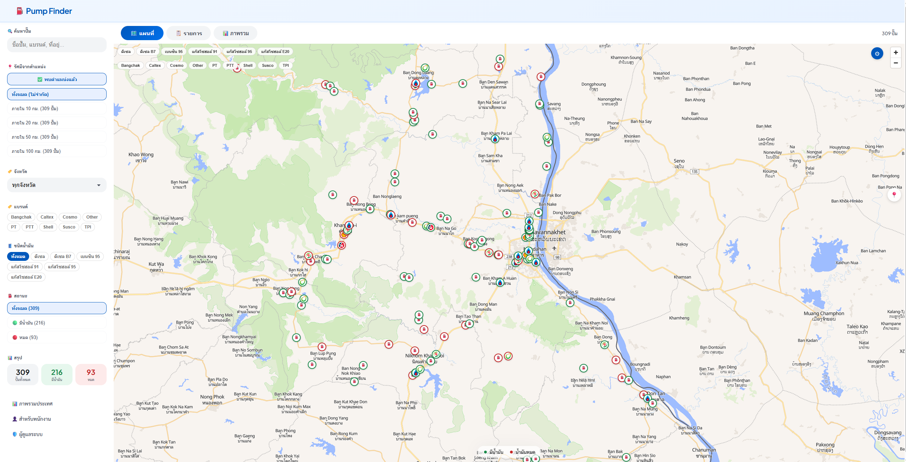
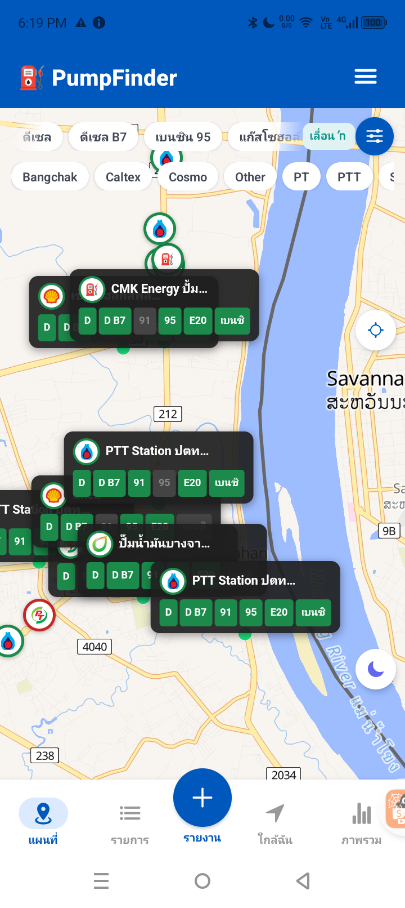
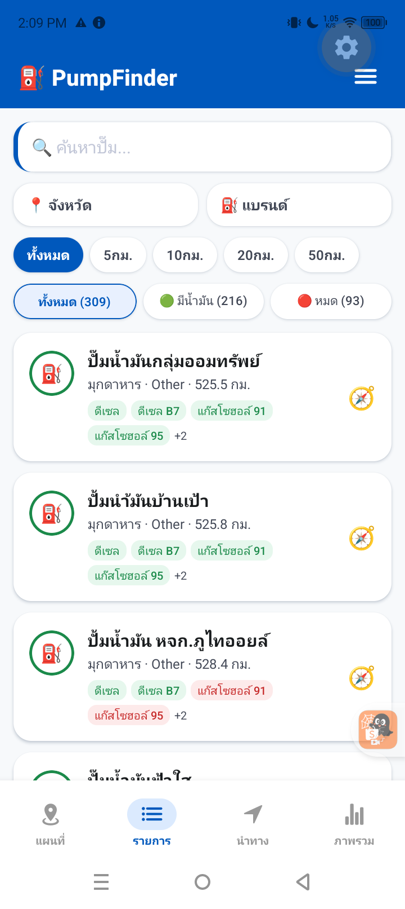

# ⛽ Pump Finder - ระบบติดตามสถานะปั๊มน้ำมัน

ระบบแจ้งสถานะน้ำมันตามปั๊มทั่วไทย ให้ประชาชนเช็คได้ว่าปั๊มไหนยังมีน้ำมัน ปั๊มไหนหมดแล้ว พร้อมนำทางไปปั๊มที่ใกล้ที่สุด

> **หมายเหตุ:** ระบบนี้จะแสดงข้อมูลที่ถูกต้องและเป็นปัจจุบันได้ก็ต่อเมื่อมี **พนักงานปั๊ม** คอยอัพเดทสถานะน้ำมัน หรือ **ประชาชน** ช่วยกันรายงานผ่านระบบ LINE Login — ยิ่งมีคนรายงานเยอะ ข้อมูลยิ่งแม่นยำ
หากจะโหลดต้ำแหน่งปั๊มทั่วประเทศต้องใช้ google api มี script ตัวอย่างในการโหลดอยู่ใน backend

ติดปัญหาตรงไหนถาม ai เลย

**Live:** [https://pingnoi.me](https://pingnoi.me) | **Contact:** [Facebook](https://www.facebook.com/arraym)

---

## Screenshots

### Desktop - แผนที่ + Sidebar


### Mobile App
 

---

## Features

### สำหรับประชาชน (Frontend + Mobile App)
- 🗺️ แผนที่ MapLibre GL (WebGL) แสดงปั๊มทั้งหมด
- 🔍 ค้นหาปั๊ม (ชื่อ, แบรนด์, ที่อยู่, จังหวัด)
- 📍 ค้นหารัศมี GPS (5/10/20/50 กม.)
- 🏷️ Filter จังหวัด, แบรนด์ (multi-select), ชนิดน้ำมัน (multi-select), สถานะ
- 🧭 นำทางไปปั๊มที่ใกล้ที่สุด พร้อมตั้งค่าแบรนด์/ชนิดน้ำมันที่ต้องการ
- 📢 **รายงานสถานะน้ำมันจากประชาชน** (Login ด้วย LINE)
  - ต้องอยู่ใกล้ปั๊ม ≤500 เมตร ถึงรายงานได้ (GPS verification)
  - เลือกปั๊มจากแผนที่ → เลือกชนิดน้ำมัน → รายงาน มี/หมด
  - นับจำนวนคนที่รายงานเหมือนกัน → ยิ่งเยอะยิ่งเชื่อถือได้
  - รายงานหมดอายุอัตโนมัติ (2 ชม. ลด confidence, 6 ชม. expire)
  - Admin เปิด/ปิดระบบได้
- 📊 ภาพรวมรายจังหวัด
- 📞 โทรหาปั๊ม
- 🔄 Real-time update ผ่าน Socket.IO

### แผนที่ 4 ระดับ Zoom
| Zoom | แสดงผล |
|------|--------|
| < 10 | จุดสีเขียว/แดง (WebGL circles) |
| 10-11 | Logo แบรนด์วงกลม |
| 12-14 | Logo + Fuel popup ใกล้กลาง |
| 15+ | Fuel popup ทุกปั๊ม |

### สำหรับพนักงาน
- ⛽ รายงานสถานะน้ำมันแต่ละชนิด (toggle เปิด/ปิด)
- 🚗 ระบุจำนวนรถที่รองรับได้
- 📝 สมัครสมาชิก + ขอเข้าร่วมปั๊ม
- 📍 ขอเพิ่มปั๊มใหม่ (เลือกพิกัดจาก GPS/แผนที่)

### สำหรับ Admin
- ⛽ จัดการปั๊ม (CRUD + แก้ไขพิกัดบนแผนที่)
- 👤 จัดการพนักงาน (เพิ่ม/ลบ/ย้ายปั๊ม)
- 🏷️ จัดการแบรนด์ + อัปโหลด Logo (Cloudflare R2)
- 📍 จัดการจังหวัด
- 🛢️ จัดการชนิดน้ำมัน + เปิด/ปิดรายปั๊ม
- 📨 อนุมัติ/ปฏิเสธคำขอ (เพิ่มปั๊ม + เข้าร่วมปั๊ม)
- 🛡️ จัดการผู้ดูแลระบบ + เปลี่ยนรหัสผ่าน
- ⚙️ ตั้งค่าระบบ (เปิด/ปิดระบบรายงานจากประชาชน)
- 📋 Audit Log (ติดตามทุกการกระทำ)

---

## Tech Stack

| ส่วน | เทคโนโลยี |
|------|-----------|
| **Frontend** | React + Vite + MapLibre GL JS |
| **Backend** | Node.js + Express + Prisma ORM |
| **Database** | PostgreSQL 16 |
| **Cache** | Redis 7 |
| **Real-time** | Socket.IO + Redis Adapter |
| **Map** | MapLibre GL (WebGL) + OpenFreeMap |
| **Mobile App** | React Native (Expo SDK 55) + WebView MapLibre |
| **Storage** | Cloudflare R2 (brand logos) |
| **Deployment** | Docker Compose (4 services) + Nginx |
| **CDN/SSL** | Cloudflare |
| **Auth** | LINE Login SDK (ประชาชน) + JWT (Staff/Admin) |
| **Security** | bcrypt + Helmet + Rate Limiting + CORS + env vars |

---

## Project Structure

```
pump/
├── backend/
│   ├── index.js                # Express API + Socket.IO
│   ├── prismaClient.js         # Prisma client
│   ├── cache.js                # Redis cache
│   ├── prisma/schema.prisma    # Database schema
│   ├── scripts/
│   │   ├── import-osm.js       # OpenStreetMap import
│   │   └── import-reviewed.js  # Reviewed station import
│   └── Dockerfile
├── frontend/
│   ├── src/
│   │   ├── components/
│   │   │   ├── common/Header.jsx
│   │   │   └── map/MapView.jsx         # MapLibre GL component
│   │   ├── hooks/
│   │   │   ├── useStations.js
│   │   │   └── useLocation.js
│   │   ├── utils/
│   │   │   ├── api.js
│   │   │   └── helpers.js
│   │   ├── pages/
│   │   │   ├── PublicHome.jsx           # แผนที่ + รายการ + ตัวกรอง
│   │   │   ├── StationDetail.jsx
│   │   │   ├── Overview.jsx
│   │   │   ├── StaffLogin.jsx
│   │   │   ├── StaffDashboard.jsx
│   │   │   ├── AdminLogin.jsx
│   │   │   └── AdminDashboard.jsx
│   │   ├── App.jsx
│   │   └── App.css                     # Design System
│   ├── nginx.conf
│   └── Dockerfile
├── mobile/
│   ├── App.js
│   └── src/
│       ├── components/
│       │   └── MapLibreMap.js           # MapLibre via WebView
│       ├── screens/
│       │   ├── StationListScreen.js     # แผนที่ + รายการ
│       │   ├── StationDetailScreen.js
│       │   ├── OverviewScreen.js
│       │   ├── StaffLoginScreen.js
│       │   ├── StaffDashboardScreen.js
│       │   ├── AdminLoginScreen.js
│       │   └── MenuScreen.js
│       ├── utils/
│       │   ├── api.js
│       │   ├── helpers.js
│       │   └── socket.js
│       └── styles/theme.js
├── docker-compose.yml           # Development (DB only)
└── docker-compose.prod.yml      # Production (DB + Redis + Backend + Frontend)
```

---

## Quick Start

### Development

```bash
# 1. Start Database
docker compose up -d

# 2. Start Backend
cd backend
npm install
npx prisma generate
npm run dev    # http://localhost:3002

# 3. Start Frontend
cd frontend
npm install
npm run dev    # http://localhost:5173

# 4. Start Mobile
cd mobile
npm install
npx expo start
```

### Production (VPS)

```bash
docker compose -f docker-compose.prod.yml up -d --build
```

### Mobile APK Build

```bash
# ต้อง set JAVA_HOME ก่อน (Android Studio JBR)
export JAVA_HOME="/c/Program Files/Android/Android Studio/jbr"
export ANDROID_HOME="$LOCALAPPDATA/Android/Sdk"
export PATH="$JAVA_HOME/bin:$PATH"

cd mobile
npx expo run:android --no-bundler
```

---

## API Endpoints

### Public
| Method | Path | Description |
|--------|------|-------------|
| GET | `/api/provinces` | รายชื่อจังหวัด |
| GET | `/api/stations-dots` | ปั๊มทั้งหมด (lightweight) |
| GET | `/api/stations-status` | ปั๊มทั้งหมด + สถานะน้ำมัน |
| GET | `/api/stations/:id` | รายละเอียดปั๊ม |
| GET | `/api/overview` | ภาพรวมรายจังหวัด |

### Staff (JWT Auth)
| Method | Path | Description |
|--------|------|-------------|
| POST | `/api/staff/login` | Login |
| POST | `/api/staff/register` | สมัครสมาชิก |
| PUT | `/api/staff/fuel-status` | อัปเดตสถานะน้ำมัน |
| POST | `/api/staff/request-station` | ขอเพิ่มปั๊ม |
| POST | `/api/staff/request-join` | ขอเข้าร่วมปั๊ม |

### Admin (JWT Auth)
| Method | Path | Description |
|--------|------|-------------|
| POST | `/api/admin/login` | Login |
| CRUD | `/api/admin/stations` | จัดการปั๊ม |
| CRUD | `/api/admin/staff` | จัดการพนักงาน |
| CRUD | `/api/admin/provinces` | จัดการจังหวัด |
| CRUD | `/api/admin/fuel-types` | จัดการชนิดน้ำมัน |
| CRUD | `/api/admin/brands` | จัดการแบรนด์ + Logo |
| GET/PUT | `/api/admin/station-requests` | คำขอเพิ่มปั๊ม |
| GET/PUT | `/api/admin/join-requests` | คำขอเข้าร่วมปั๊ม |
| GET | `/api/admin/audit-logs` | Audit Log |

---

## Database Schema

```
provinces ──< stations ──< fuel_status
                       ──< staff
                       ──< staff_station_requests
                       ──< station_requests
staff ──< staff_station_requests
admins
audit_logs
brands
```

---

## Security

- JWT authentication (auto-refresh, 7-day expiry)
- bcrypt password hashing
- Helmet HTTP headers
- Rate limiting (300 req/min)
- CORS restriction
- All admin actions audited

---

## License

MIT

---

Built with [Claude Code](https://claude.com/claude-code)
